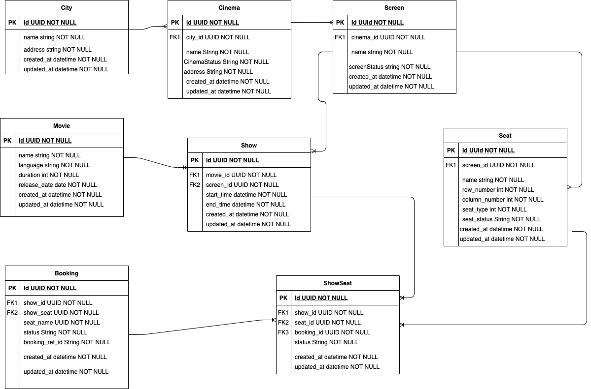

# Booking Service
Movie booking service is a Spring Boot-based application designed to manage movie show listings and 
facilitate ticket bookings. It provides RESTful APIs for retrieving available shows and booking movie tickets.

# Features
* Retrieve available movie shows by city and movie name.
* Book tickets for selected movie shows.
* Interactive API documentation with Swagger UI

# Technologies Used
    Java 17
    Spring Boot
    Spring Data JPA
    H2 Database
    Liquibase
    Swagger/OpenAPI
    Gradle

# Dependencies
* Java 17
    * We recommend using [jenv](https://www.jenv.be/) to manage your java versions.

# Getting Started
* Clone the Repository
    * git clone https://github.com/kanagaraj1989/movie-booking.git
    * cd movie-booking
    
# How to run
    ./gradlew run
    The application will start on http://localhost:8080

# api document
    all api document available in this url: http://localhost:8080/swagger-ui/index.html

#Entity Relationship Diagram
* The below diagram illustrates the relationships between entities such as City, Cinema, Screen, Show, and Booking.

#DB
* Uses H2 in-memory database for development and testing.
* Database console accessible at: http://localhost:8080/h2-console
    * JDBC URL: jdbc:h2:mem:movie-booking
    * Username: movie-booking
    * Password: (leave blank)
    
#DB Schema manage
* This project utilizes Liquibase for managing, tracking, and automating database schema changes.
    * Changelogs are defined in the `src/main/resources/db/changelog/sql/` directory
    * Liquibase applies these changelogs automatically on application startup.
